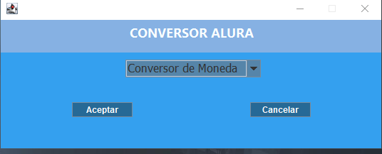
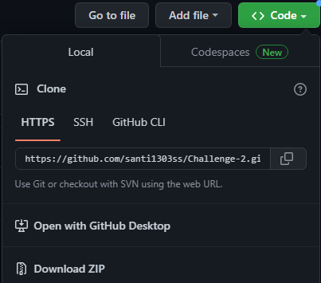

# Ejemplo
### De mi 
### Pryecto de conversiones

👋Hola, el dia de hoy hablaremos sobre el desarrollo de un pequeño proyecto desarrolaldo en ALura, como ejemplo para nuestro markdown 

## Ejercicio planteado
En esta oportunidad, a los Devs se nos solicitó crear un conversor de divisas utilizando el lenguaje Java. Las características solicitadas por nuestro cliente son las siguientes:

Requisitos:
- El convertidor de moneda debe:

       - Convertir de la moneda de tu país a Dólar
       - Convertir de la moneda de tu país  a Euros
       - Convertir de la moneda de tu país  a Libras Esterlinas
       - Convertir de la moneda de tu país  a Yen Japonés
       - Convertir de la moneda de tu país  a Won sul-coreano
       
Recordando que también debe ser posible convertir inversamente, es decir:

       - Convertir de Dólar a la moneda de tu país
       - Convertir de Euros a la moneda de tu país
       - Convertir de Libras Esterlinas a la moneda de tu país
       - Convertir de Yen Japonés a la moneda de tu país
       - Convertir de Won sul-coreano a la moneda de tu país
       
>Extras:
Como desafío extra te animamos a que dejes fluir tu creatividad, si puedo convertir divisas, ¿tal vez pueda añadir a mi programa otros tipos de conversiones como temperatura por ejemplo?

Es hora de sorprender a nuestro cliente con una función que tal vez ni siquiera sabía que necesitaba.

### ---------------------------------DESARROLLO DEL EJERCICIO -------------------------------------
## 📜 Funciones de conversión:
- Longitud ⏲
- Masa ⏳
- Capacidad 📦
- Temperatura 🌡
- Divisas 💱

## 📜 Previas
+ Cuenta con 10 conversiones monetarias distintas 👛
+ Cuenta con un la totalidad de temperaturas : °C, °F, K, °R 🌡
+ Cuenta con una gama muy completa de medidas:
  * Longitud ⏲
  * Masa Ⓜ
  * Capacidad 👌

> Gracias **Alura** : 
*Bueno principalmente quiero que sepan que soy estudiante de* ***Oracle Next Education***, *mi formacion es virtual por medio de una de las mejores plataformas de aprendizaje, esta es* ***ALura***, *es aqui donde parte este ejercicio el cual fue un verdadero reto ya que puso aprueba mi logica y para mi es una asaña poder traerles este codigo para ustedes, intente hacerlo lo mas completo desde el diseño compacto hasta un funcionamiento limpio.*

### Ejemplo de codigo
Me gustaria que antes de pasar  con el codigo entiendan como lo diseñe, para la construcion de este me base en Array que son una especie de listas donde una conserva el valor de la moneda y otro lo que vendria siendo el nombre o simbolo de la moneda, pero claro el siguiente sera un ejemplo semejante al codigo fuente del programa que he diseñado.

```java
<?java
  echo "# Definimos las tasas de cambio
tasa_colombia = 3600  # 1 dólar = 3600 pesos colombianos

# Definimos una lista de opciones para el usuario
opciones = ["Dólares a pesos colombianos", "Pesos colombianos a dólares"]

# Pedimos al usuario que seleccione una opción
print("Seleccione una opción:")
for i, opcion in enumerate(opciones):
    print(f"{i+1}. {opcion}")
opcion_seleccionada = int(input("Opción seleccionada: "))

# Pedimos al usuario que ingrese la cantidad a convertir
cantidad = float(input("Ingrese la cantidad a convertir: "))

# Convertimos la cantidad según la opción seleccionada
if opcion_seleccionada == 1:
    resultado = cantidad * tasa_colombia
    print(f"{cantidad:.2f} dólares son {resultado:.2f} pesos colombianos")
elif opcion_seleccionada == 2:
    resultado = cantidad / tasa_colombia
    print(f"{cantidad:.2f} pesos colombianos son {resultado:.2f} dólares")
else:
    print("Opción inválida")";
?>
```
*En este código, definimos la tasa de cambio entre dólares y pesos colombianos como una constante. Luego, presentamos al usuario una lista de opciones para seleccionar:* **convertir dólares a pesos colombianos o pesos colombianos a dólares**. *Una vez que el usuario selecciona una opción y proporciona la cantidad a convertir, realizamos la conversión según la fórmula correspondiente y mostramos el resultado al usuario.*

 
 
> Seguido de esto podrian entender la clase que convertira las divisas, la de temperatura es muy semejante y las longitudes pues si cambiara algo pero en si todo parten de unos array que conectaran con condicionales para establecer su valor correspondiente dependeinedo la unidad de medida, tambien puedes ver mas imagenes en la carpeta que se encuentra en el repositorio.

## INSTALACION 
> INSTALACIÓN: para usar este proyecto es importante que lo descarges por medio de zip o lo clones por medio de tu repositorio local, si por algun motivo escoges la segunda opcion sigue los siguentes pasos:
 - En GitHub.com, navega a la página principal del repositorio. 1. Encima de la lista de archivos, haga clic en  Código.
 
 

*Copia la dirección URL del repositorio.*
Para clonar el repositorio con HTTPS, en «HTTPS» haz clic en.
Para clonar el repositorio mediante una clave SSH, incluido un certificado emitido por la entidad de certificación SSH de la organización, haga clic en Usar SSH y luego en .
Para clonar un repositorio mediante GitHub CLI, haz clic en GitHub CLI y, después, haz clic en copiar.
- . Abra Git Bash.
- . Cambia el directorio de trabajo actual a la ubicación en donde quieres clonar el directorio. 
- . Escriba git clone y pegue la dirección URL que ha copiado antes.
- . Presione **Entrar** para crear el clon local.
```

Listo con esto ya lo tendra en tu disposicion y buena suerte en tu camino como programador recuerda que todo es una bendicion *SALUDOS*. 👋
